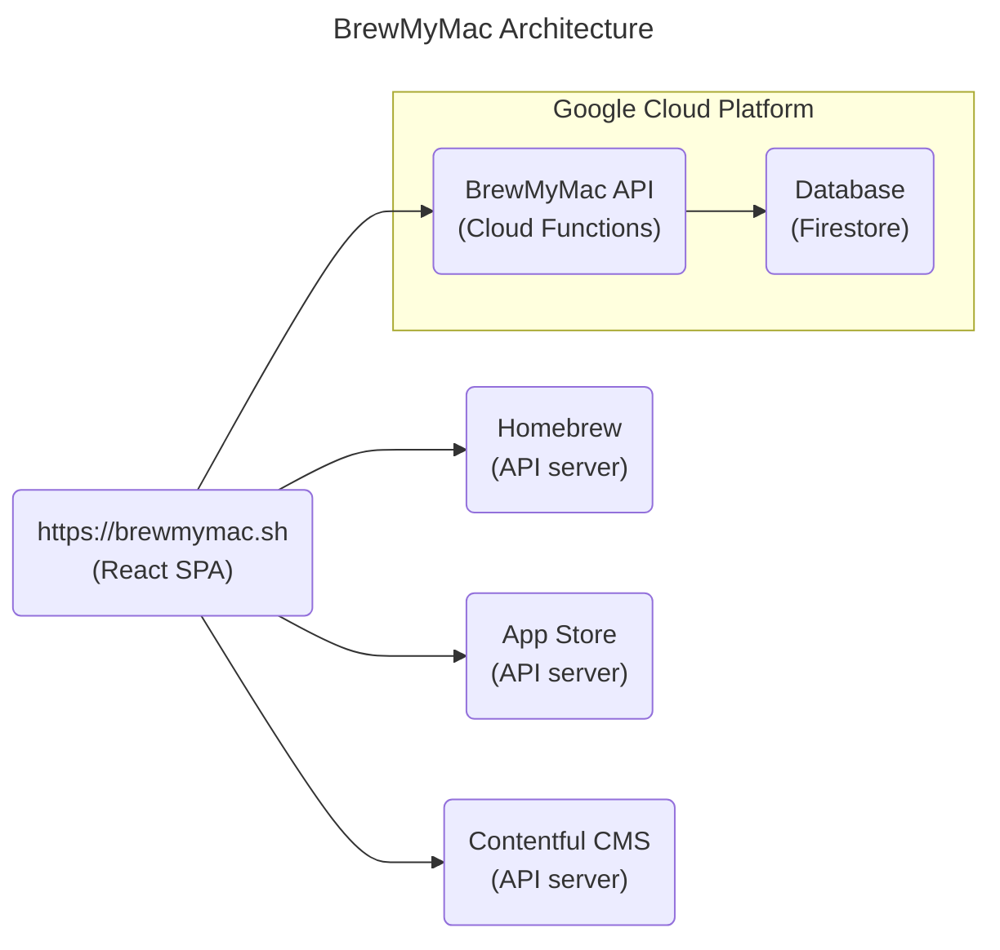

# BrewMyMac

Gone are the days of manually installing apps and hunting for tweaks on your Mac. Introducing [BrewMyMac](https://brewmymac.sh), the revolutionary tool that automates the entire process, saving you time and effort.

*One command, infinite possibilities!*

## Introduction

As a software engineer, I was tired of the tedious and time-consuming process of setting up a new Mac. I knew there had to be a better way. That's why I created [BrewMyMac](https://brewmymac.sh), a powerful tool that empowers you to:

* **Install thousands of apps and tweaks with a single command.** No more searching for downloads or navigating complex installation processes. [BrewMyMac](https://brewmymac.sh) curates a massive library of over 10,000 essential apps and popular tweaks, making it a one-stop shop for your Mac customisation needs.
* **Customise your Mac to your unique style.** Express your individuality with a wide range of customisation tweaks. From themes and icons to dock configurations and hidden features, [BrewMyMac](https://brewmymac.sh) lets you tailor your Mac to your exact preferences.

This [article](https://ayltai.medium.com/install-mac-apps-and-tweaks-with-a-single-command-6b1b90c466b5) explains the motivation behind this project.

### Supported package repositories

* [Homebrew](https://brew.sh/): The missing package manager for macOS
* [Homebrew Cask](https://formulae.brew.sh/cask/) An extension to [Homebrew](https://brew.sh/) that allows you to install macOS applications
* [AppStore](https://www.apple.com/app-store/): A macOS app store platform maintained by Apple Inc

### Supported tweaks

* [macOS tweaks](https://github.com/ayltai/ansible-macOS-tweaks): A collection of over 50 macOS customisations

## Architecture

## Getting started

Try it here: [https://brewmymac.sh](https://brewmymac.sh)

The documentation for the backend can be found [here](backend/README.md).

The documentation for the frontend can be found [here](frontend/README.md).

The documentation for the infrastructure provisioning and deployment can be found [here](infra/README.md).
