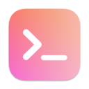

# BrewMyMac

[BrewMyMac](https://brewmymac.sh) automates how you install apps and customise your Mac safely and easily. It generates effortless and reproducible installation commands that you can share with others.

## Introduction

This [article](https://ayltai.medium.com/install-mac-apps-and-tweaks-with-a-single-command-6b1b90c466b5) explains the motivation behind this project.

### Supported package repositories

* [Homebrew](https://brew.sh/): The missing package manager for macOS
* [Homebrew Cask](https://formulae.brew.sh/cask/) An extension to [Homebrew](https://brew.sh/) that allows you to install macOS applications
* [AppStore](https://www.apple.com/app-store/): A macOS app store platform maintained by Apple Inc

### Supported tweaks

* [macOS tweaks](https://github.com/ayltai/ansible-macOS-tweaks): A collection of over 50 macOS customisations

## Getting started

Try it here: [https://brewmymac.sh](https://brewmymac.sh)

The documentation for the backend can be found [here](backend/README.md).

The documentation for the frontend can be found [here](frontend/README.md).

The documentation for the infrastructure provisioning can be found [here](infra/README.md).
